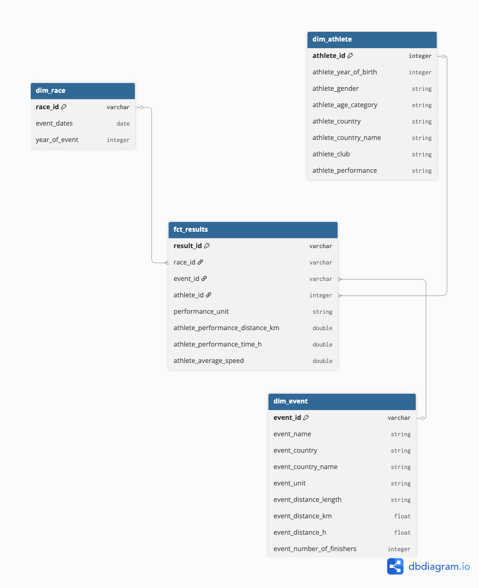

# Marathos Lab Big Data Cloud Course 

## Structure: 

### Medallian Architecture 
#### Bronze 
- Ingesting data into the bronze layer 

#### Silver 
- Cleaning of the dataset 

"add steps cleaned here" 

- Output into OBT (one big table)
- 

#### Gold

### Dimensional Modeling 

The demensional modeling is done in [DB Diagram](https://dbdiagram.io/home)

### Dashboard 

## Sources and Documentation 

**Raw dataset:**

[Ultra Marathon Running Dataset - Kaggle](https://www.kaggle.com/datasets/aiaiaidavid/the-big-dataset-of-ultra-marathon-running)

[Country Raw dataset iso 3166 - GitHub](https://github.com/ipregistry/iso3166.git)

**Sources:**

[Databricks documentation](https://docs.databricks.com/aws/en/)

[Apache Spark doucmentation](https://spark.apache.org/docs/latest/api/python/index.html)
