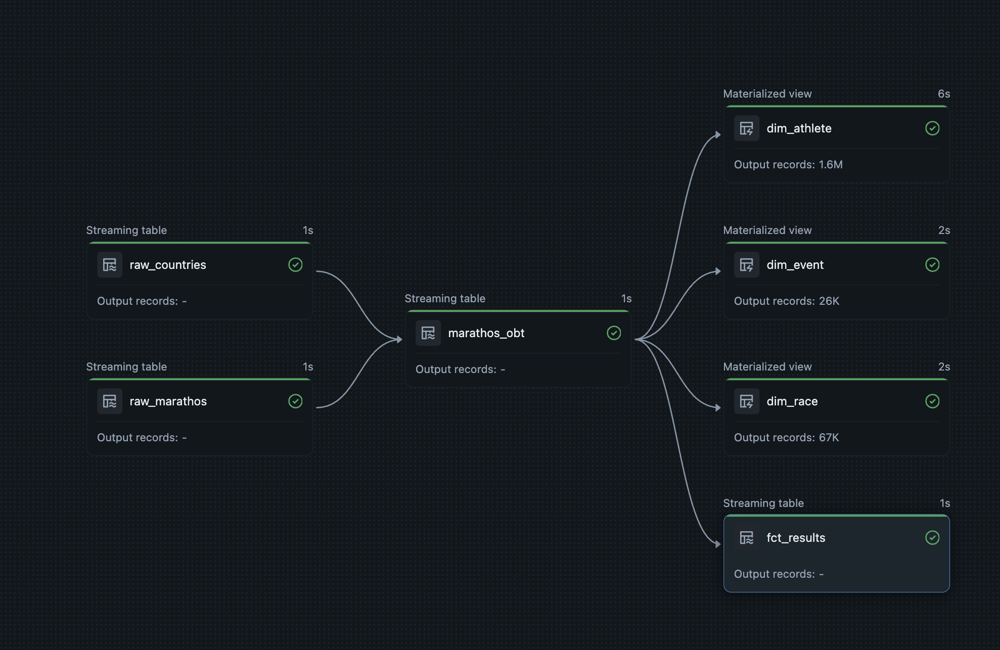

# Marathos Lab Big Data Cloud Course - Medallian Architecture 

Purpose of this project is to use your knowledge of Databricks and data engineering to build data
platform and pipeline for business stakeholders to aid in data driven decisions. You are working for a
global company called Marathos, which hosts marathons all over the world.

#### Bronze 
- Ingesting data into the bronze layer 

#### Silver 
**Cleaning of the dataset:**
- **Standardization:** Converted all column names to `snake_case`.
- **Data Sanitization:** Stripped special characters (`#`, `*`, `"`) and trimmed whitespace from strings.
- **Schema Enforcement:** Cast `event_dates` to proper Date type and birth years to Integers.
- **ID Generation:** Created unique `SHA-256` hash keys for `event_id`, `race_id`, and `result_id`.
- **Geographic Enrichment:** Enriched athlete and event data with full country names using ISO reference data.
- **Unit & Distance Normalization:** Parsed units (`km`, `mi`, `h`) and converted miles to kilometers for unified metrics.
- **Performance Calculation:** Cleaned time strings into decimal hours and calculated standardized running speeds (km/h).
- **Data Validation:** Filtered out invalid performances (e.g., DNF / broken records) and structured the output into an optimized One Big Table (OBT).

#### Gold

- Create gold layer based on dimensional model 

- Create viwes for the marathon types (distance, length)

#### Pipeline graph - bronze -> silver -> gold 

### Dimensional Modeling 

The demensional modeling is done in [DB Diagram](https://dbdiagram.io/home)

### Dashboard 

## Sources and Documentation 

**Raw dataset:**

[Ultra Marathon Running Dataset - Kaggle](https://www.kaggle.com/datasets/aiaiaidavid/the-big-dataset-of-ultra-marathon-running)

[Country Raw dataset iso 3166 - GitHub](https://github.com/ipregistry/iso3166.git)

**Sources:**

[Databricks documentation](https://docs.databricks.com/aws/en/)

[Apache Spark doucmentation](https://spark.apache.org/docs/latest/api/python/index.html)

